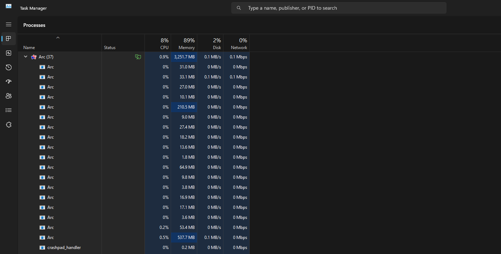

---
layout:
  title:
    visible: true
  description:
    visible: false
  tableOfContents:
    visible: false
  outline:
    visible: true
  pagination:
    visible: false
---

# 2.2 PC Introduction

***

## Computer Systems

A computer system can be broken down into four layers. 
1. User: The person or program that interacts with the computer
2. Applications: Software built on the operating system that allow for user interaction
3. Operating system: The software layer between application programs and the hardware
4. Device or computer hardware: The physical computer

When a user takes an action, the effects of that action trickles down to the other three layers. As a result, evidence of that action is generated at each layer. 

A computer can be broken down into many parts, as shown in the diagram below. The most important parts of a computer for digital forensic practitioner are the drive bayes, RAM, and CPU.

[TODO: insert image here]

We can check out information about a Windows system in the command line using the `systeminfo` command.

[TODO: insert image here]

## How Do Computer Systems Work?

A computer is a TODO.

On Windows, the task manager allows us to view the processes associated with an application.

<figure><figcaption>
The task manager shows the Arc application, which has a "(37)" next to its name, and its associated processes in the drop down menu. 
</figcaption></figure>

## Why is Computer Forensics Hard?

Computer forensics is difficult and complex because of technical complexities and ever-advancing technology. Computer forensics professionals works with different types and versions of operating systems, different types and versions of applications, and a variety of hardware. The need to analyze non-traditional devices such as Internet of Things (IoT) devices pose an additional challenge. 

Computer forensics practitioners may work with malware, OS and application logs, memory, application processes, CPU execution, etc. With such a large quantity of varied information, we need to be able to collect, analyze, and verify evidence in a systematic manner.

Skilled computer forensic practitioners understand not only computer science and security, but also criminal justice and law.

## Hard Disk Drives
A hard disk consists of a set of magnetic platters. Data is stored in the polarity of the platters.

Each platter, or plate, consists of a surface many tracks. A track is a concentric circle made of a ring of magnets. Each track can be subdivided into sections called a sector. All tracks with a certain radial distance from the center is called a cylinder.

The platters spin around, and the arm moves and reads data through its heads.

[TODO: insert image here]

A sector is the minimum storage unit of a hard drive. Regardless of a file's actual size, files occupy an integral number of sectors.

We can calculate the number of sectors in a disk calculated as such:

$$
numSectors = numTracks \cdot numHeads \cdot sectorsPerTrack
$$

For example, if there are 400 sectors per track, 12 heads, and 17,000 tracks, then there are 8,1600,000 sectors.

We can calculate the size of a disk as such:

$$
diskSize = numSectors \cdot bytesPerSector
$$

For example, if each sector is 512 bytes and there are 8,1600,000, then the disk is 41779200000 bytes or 38.91GB. Notice that because we work in powers of 2, 1KB is 1024 bytes, not 1000. Likewise, 1MB is 1024KB, and 1GB is 1024MB.

## Calculating Disk Partitions
A disk partition is a region of a disk.

[TODO: insert image here]

We can calculate the size of disk partitions using the software WinHex. BOOKMARK.

## PC Boot Process
A PC boots with these steps:
1. 
2.
3.
4.

BOOKMARK

## File Systems
A file system is an operating system abstraction of storage. A file system how files are named, stored, and retrieved from a storage device. A file, really just a bunch of bytes, is a storage object and disk abstraction that is created and destroyed on demand.

We often think of file systems as a hierarchical tree where the nodes of the tree are directories, or folders, and files.

[TODO: insert image here]

Different operating systems use different file systems:
- Linux uses XFS, JFS, and btrfs.
- macOS uses the Hierarchical File System (HFS).
- Microsoft Windows uses File Allocation Table (FAT) and New Technology File System (NTFS).

#### Up Next: [Windows Command Line Tutorial](2.3-windows-command-line-tutorial.md)

***

[Home](https://sophiecchen.gitbook.io/sophie-chen) ⋅ [Work](https://sophiecchen.gitbook.io/sophie-chen/work) ⋅ [Thoughts](https://sophiecchen.gitbook.io/sophie-chen/thoughts)
